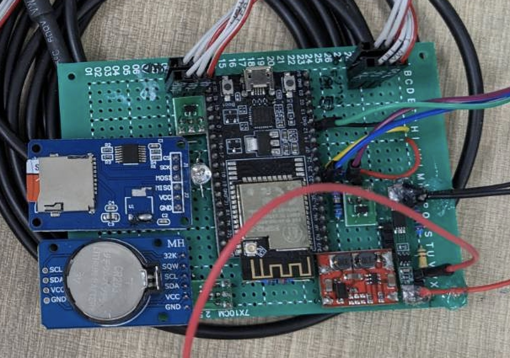

# WildlifeObserveDevice

## 0x00. Description

A card-sized **tiny, low-power field bioacoustic recording device**, measuring only **50x70 mm**.

Contains temperature, humidity detection, RTC timer and a web for time adjustment and firmware update.

You can set when to perform tasks every day and automatically save them to the SD card.

And it can operate continuously for more than 40 days with four 18650 batteries, 14 times of 15-minute recording and 144 times of temperature and humidity sensing per day.

一個卡片大小的 **迷你、低功耗的野外生物聲學紀錄裝置**，大小僅 **50x70 mm**。

包含溫度、濕度偵測、RTC 時鐘、時間調整及韌體更新的簡易網頁。

可設定每日何時執行任務，並自動儲存至 SD 卡。

並且可以在四顆 18650 電池，每日執行 14 次 15 分鐘錄音與 144 次溫濕度感測的設置下，連續運作 <u>**40日**</u> 以上。

 

## 0x01. Hardware

### A. Functional parts

* Micro-controller (Esp32)
* MEMS microphone (INMP441, I2S)
* RTC timer (DS3231, I2C)
* Temperature and humidity sensor (DHT22, unknown protocol)
* Temperature sensor (DS18B20, one-wire)
* High efficiency synchronous step-down
converter (RT5707WSC, no protocol & always on)
* Power switch for sensors (AO3401A, no protocol & controlled by GPIO)
* TF card reader (TF card slot, SPI)
* Battery voltage detection (ESP32 itself, analog input)

### B. Design and versions

#### a. draft ver (v0.1.0)

* wiring
    

    
    

* real shot
    

    
    

#### b. pcb_v1 (v1.0.0)

* schematic
    

    
    
    

* wiring and 3D module
    

    
    
    

* real shot
    

    
    

## 0x02. Firmware

### A. Features

1. **A web setting page for RTC time check and firmware update**
   * TBD(pic)
2. **Non-blocking task environment with RTOS**
   * Provide a non-blocking environment for I2S recording, TF-Card writing and reading of other sensors at a same time.
3. **Routine work scheduler for specific time of task with RTC timer**
   * We can give tasks with specific time instead of time period.
4. **Power control of peripheral devices**
   * Use PMOS as switch to cut off power of sensors.

## 0x03. Issue list

### A. draft ver (v0.1.0)

#### a. Hardware part

* Poor power efficiency of DC/DC convertor.
* Additional power leak from USB-UART chip on ESP32 module.
* Poor contact of RTC battery / RTC module.
  * It let RTC time reset under unexpected circumstances.
* Untidy wiring and unable to control quality.

#### b. Firmware part

* Cross day error. (fixed)

### B. pcb_v1 (v1.0.0)

#### a. Hardware part

* LED_BLUE & LED_GREEN not work
  * GPIO only accept INPUT.
* E73-2G4M08S1C(nRF52832 wireless module) not tested yet
* Sometimes still have unexpected RTC reset.
  * Even we changed the battery type and slot for it.
* We don't have a debug prob / upload port of ESP32.

#### b. Firmware part

* Unknown panic when it continue operation for several days.
  * Temporary fixed. By automatically reboot just after sound recording finished.
    * We cannot find the root cause even we trace the error message of guru meditation output.
    * We guess is caused by Ex-fat lib (community) or I2S recording lib (official).
